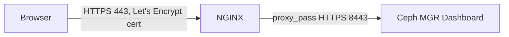

# Day 5 — Ceph Dashboard, NGINX Reverse Proxy, and Let's Encrypt

By default, the Ceph Dashboard runs on port `8443` with a self-signed certificate. This guide puts **NGINX** in front of it as a reverse proxy and secures it with a **Let's Encrypt** certificate.

---

## 5.1 Confirm Dashboard Is Running

```bash
ceph mgr services
```

Expected output:

```json
{
    "dashboard": "https://ceph1:8443/"
}
```

Log in with the credentials printed during Day 3 bootstrap (or reset them):

```bash
echo "NewStrongPassword123" > /tmp/pass.txt
ceph dashboard ac-user-set-password admin -i /tmp/pass.txt
rm /tmp/pass.txt
```

---

## 5.2 Install NGINX

On the node that will act as the reverse proxy (commonly ceph1, or a separate front-end node):

```bash
sudo apt install -y nginx
```

---

## 5.3 Configure NGINX as a Reverse Proxy

Create a new site config:

```bash
sudo tee /etc/nginx/sites-available/ceph-dashboard <<'EOF'
server {
    listen 80;
    server_name ceph-dashboard.example.com;

    location / {
        proxy_pass https://127.0.0.1:8443;
        proxy_ssl_verify off;

        proxy_set_header Host $host;
        proxy_set_header X-Real-IP $remote_addr;
        proxy_set_header X-Forwarded-For $proxy_add_x_forwarded_for;
        proxy_set_header X-Forwarded-Proto $scheme;
    }
}
EOF
```

> Replace `ceph-dashboard.example.com` with your actual domain name pointing to this node's public/internal IP.

Enable the site:

```bash
sudo ln -s /etc/nginx/sites-available/ceph-dashboard /etc/nginx/sites-enabled/
sudo nginx -t
sudo systemctl reload nginx
```

---

## 5.4 Install Certbot for Let's Encrypt

```bash
sudo apt install -y certbot python3-certbot-nginx
```

---

## 5.5 Obtain and Install the SSL Certificate

```bash
sudo certbot --nginx -d ceph-dashboard.example.com
```

Certbot will:

- Validate domain ownership via HTTP-01 challenge
- Automatically edit the NGINX config to add a `listen 443 ssl` block
- Install the certificate and set up auto-renewal

---

## 5.6 Verify Auto-Renewal

Certbot installs a systemd timer automatically. Confirm it:

```bash
systemctl list-timers | grep certbot
sudo certbot renew --dry-run
```

---

## 5.7 Final Access

The Ceph Dashboard is now reachable securely at:

```
https://ceph-dashboard.example.com
```

Traffic flow:



---

## 5.8 Checklist

- [ ] Dashboard accessible directly on `:8443` (internal check)
- [ ] NGINX installed and reverse-proxying to `:8443`
- [ ] DNS record for `ceph-dashboard.example.com` points to the proxy node
- [ ] Let's Encrypt certificate issued and NGINX serving HTTPS on 443
- [ ] Auto-renewal confirmed via `certbot renew --dry-run`

---

## Guide Complete 🎉

You now have a fully functioning 3-node Ceph Squid cluster on Ubuntu with:

- 3 MONs in quorum
- 2+ MGRs (active/standby)
- 3 OSDs (one per node)
- Dashboard secured behind NGINX + Let's Encrypt HTTPS

Return to the [repo root](../README.md) for the full guide index.
